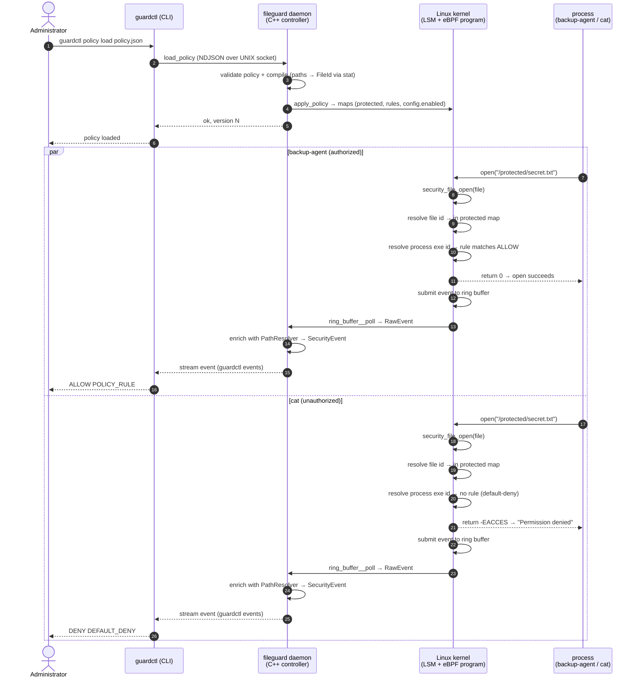
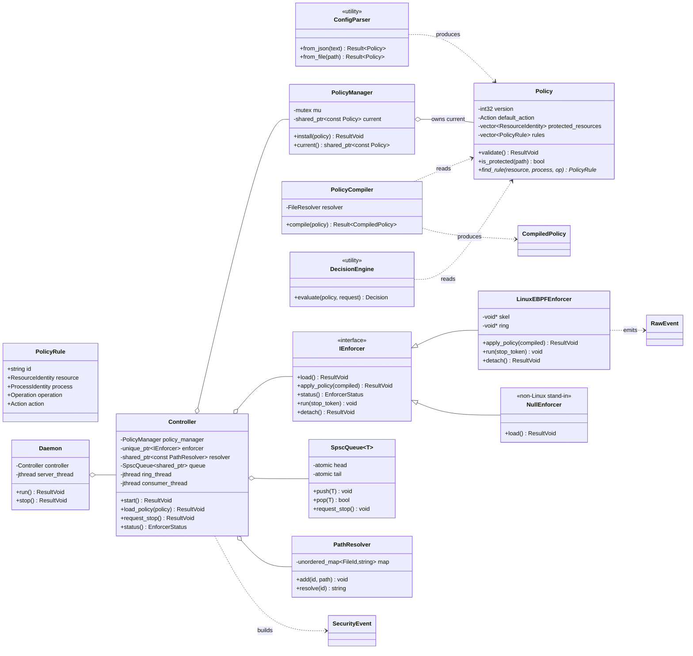
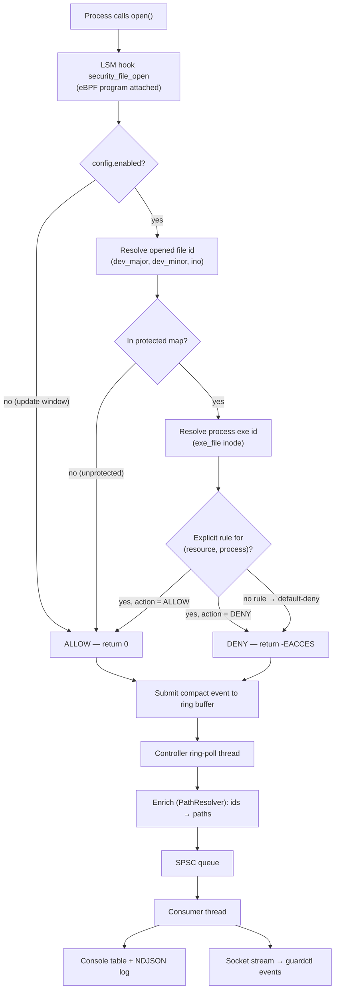

# eBPF FileGuard

**Kernel-Assisted Runtime File Access Control**

A Linux runtime file-access security system built with **eBPF LSM** and
**modern C++ (C++23)**. Administrators define an allow-list policy — *this
file, opened by this executable, is allowed* — and the decision is enforced
**inside the kernel** at the `security_file_open` LSM hook. Every decision on
a protected resource produces a structured security event streamed to a C++
userspace controller.

> **Security notice:** this is a learning-oriented security project. It is
> *not* a replacement for SELinux or AppArmor. Read
> [`docs/11-limitations.md`](docs/11-limitations.md) before deploying
> anywhere real.

---

## Table of contents

- [The problem we are solving](#the-problem-we-are-solving)
- [Why eBPF?](#why-ebpf)
- [Features](#features)
- [How it works](#how-it-works)
- [Diagrams](#diagrams)
- [Requirements](#requirements)
- [Quick start](#quick-start)
- [Build](#build)
- [CLI reference](#cli-reference)
- [Policy format](#policy-format)
- [Security events](#security-events)
- [Testing](#testing)
- [Test matrix](#test-matrix)
- [Performance](#performance)
- [Security model & limitations](#security-model--limitations)
- [Architecture](#architecture)
- [Documentation index](#documentation-index)
- [Repository layout](#repository-layout)
- [Roadmap](#roadmap)
- [FAQ](#faq)
- [License](#license)

---

## The problem we are solving

### The core problem

Linux systems protect files with **DAC** permissions (ownership + mode bits)
and may add **MAC** frameworks (SELinux, AppArmor). Both answer the question
"*who* may access this file" in terms of **users** or **system-wide labels**.

Neither answers a narrower, increasingly common question:

> **"This one file — `/protected/secret.txt` — may be *opened* only by the
> backup agent. Nothing else. Not `cat`. Not `vim`. Not even root."**

That requirement is:

| Property | Why it matters |
|---|---|
| **Per-resource** | only a handful of files are sensitive; the rest must behave normally |
| **Per-process** | authorization is keyed on *which program* runs, not which user launched it |
| **Kernel-enforced** | a compromised/careless process must not be able to "ignore" the decision |
| **Programmable** | the policy should be versioned, validated and hot-loaded like configuration |
| **Auditable** | every denied (and allowed) attempt must produce a security event |

### Why the existing tools fall short

| Mechanism | Question it answers | Gap for our problem |
|---|---|---|
| **DAC permissions** | "Is this *user* allowed?" | per-user, not per-program; **root bypasses it**; no decision audit |
| **SELinux** | system-wide type-enforcement policy | powerful but heavy; often disabled/unconfigured for one app |
| **AppArmor** | per-program profiles | closest conceptually, but system policy, not a data-driven runtime API |
| **auditd** | "what happened?" | observes only — **cannot deny** |
| **strace** | debugging | userspace observation; no enforcement; detectable |
| **inotify** | filesystem notifications | fires *after* the open; no process identity; no enforcement |

### The gap FileGuard fills

A **default-deny, per-executable, kernel-enforced allow-list** for protected
files — small enough to reason about, strict enough to protect specific
secrets, with structured telemetry — deployed where SELinux/AppArmor are
**unavailable, unconfigured, or need a programmable application-specific
layer**.

### What FileGuard is NOT

- Not a replacement for SELinux/AppArmor (see [comparison](docs/12-comparison.md)).
- Not protection against a compromised kernel or a privileged attacker
  ([threat model](docs/02-threat-model.md)).
- Not a pathname-based tool: identity is the **inode**, so path tricks fail,
  at the documented cost of install-time TOCTOU ([limitations](docs/11-limitations.md)).

### SELinux and AppArmor are optional

FileGuard does **not** require, call, or depend on SELinux or AppArmor. It
works on a plain Linux kernel that has eBPF enabled — no security framework
installed, no policy written. The only kernel features it needs are:

- `CONFIG_BPF` + `CONFIG_BPF_LSM` (eBPF + the ability to attach to LSM hooks),
- `CONFIG_BPF_RINGBUF` (event transport),
- `CONFIG_DEBUG_INFO_BTF` (CO-RE portability),
- `bpf` listed in `CONFIG_LSM`.

> Important distinction: **eBPF LSM is a kernel feature, not a security
> framework.** `CONFIG_BPF_LSM` lets eBPF programs attach to the kernel's LSM
> hooks. It has nothing to do with whether SELinux or AppArmor is enabled.
> So FileGuard runs on hosts where SELinux is disabled, AppArmor is
> unconfined, or both are absent entirely — and on hosts where they are
> active (FileGuard simply adds an extra, application-specific layer).

---

## Why eBPF?

The decision has to be **enforced**, not merely reported. That forces the
logic into the kernel, and eBPF is the safe, portable, programmable way to
put it there:

| Reason | What it gives us |
|---|---|
| **Enforcement at the security boundary** | attached to the `security_file_open` **LSM hook**, the program's return value *is* the decision — the syscall fails with `EACCES`; a userspace process cannot "ignore" the denial |
| **Audit cannot be suppressed** | the event is emitted from the same kernel program; the monitored process has no handle on it |
| **Verifier safety** | the kernel verifier rejects unsafe programs — no arbitrary memory access, no way to inject logic; policy lives in kernel maps an attacker cannot write |
| **Portability (CO-RE/BTF)** | the same program runs across kernel versions without recompiling against each |
| **High-throughput events** | BPF **ring buffer** moves events to userspace with bounded memory |
| **Low overhead on the hot path** | an open on an *unprotected* file is one hash-map miss → allow |

Why eBPF rather than a kernel module? A module runs with full kernel trust
and can crash the kernel; an eBPF program is **checked before it runs** and
can be loaded/unloaded by a normal privileged process — which is exactly the
control surface a security *controller* wants to own.

Why eBPF **LSM** and not tracing (kprobes/tracepoints)? Tracing programs fire
*after* the syscall is underway and cannot reliably stop it. LSM hooks run
*inside* the security decision path, so they can both observe **and** deny
(see [docs/06-ebpf-design.md](docs/06-ebpf-design.md)).

And the rest of the stack: **C++23** because the controller is a real
concurrent systems component (`std::expected` error channels, `std::jthread`
cancellation, lock-free SPSC event queue), and **libbpf/CO-RE** because it is
the maintained standard for userspace eBPF management.

> Honesty check: eBPF is **not** automatically "more secure than
> SELinux/AppArmor." It is a *different tool* — narrow, programmable and
> kernel-enforced — with its own weaknesses (privileged attackers, identity
> model, fail-open semantics). See
> [docs/08-security-model.md](docs/08-security-model.md) and
> [docs/12-comparison.md](docs/12-comparison.md).

---

## Features

- **Kernel-enforced** default-deny allow-list for protected files
  (`security_file_open` eBPF LSM hook, Linux 5.7+).
- **Per-executable identity**: policy is keyed on the process's executable
  image (Level-1 identity, documented evolution path to content hashing).
- **Inode-based resource identity** (`major:minor:ino`) — symlinks, hard
  links and renames cannot bypass the policy.
- **Structured security events** (console table + NDJSON log + live socket
  stream) for every decision on a protected resource.
- **Portable C++23 core**: policy engine, decision logic and the controller
  build and unit-test on macOS and Linux; the eBPF backend is Linux-only and
  cleanly abstracted behind `IEnforcer`.
- **Concurrency-safe pipeline**: lock-free SPSC event queue, atomic policy
  swaps, structured shutdown (`std::jthread`/`stop_token`).
- **Control plane** over a UNIX socket: `status`, `policy validate|load|list`,
  `events`, `stop`.

## How it works

```
cat calls open("/protected/secret.txt")
        │
        ▼
security_file_open(file)        ── LSM hook in the kernel VFS open path
        │
        ▼
eBPF program (ebpf/fileguard.bpf.c)
  1. opened-file identity = (dev_major, dev_minor, ino)
  2. in protected map?  ──no──► return 0            (unprotected = allow)
  3. process identity = (dev_major, dev_minor, ino) of the executable image
  4. rule for (resource, process) in rules map?
        ├─ yes ──► apply rule action
        └─ no  ──► DENY (default-deny for protected resources)
  5. submit compact event to the BPF ring buffer
        │
        ▼
return 0  |  -EACCES            ──► syscall succeeds | fails "Permission denied"
        │
        ▼
guardctl daemon (Linux):
  ring-poll thread → RawEvent → PathResolver (ids→paths) → SecurityEvent
        │
        ▼
SPSC queue → consumer thread → console table + NDJSON log + `guardctl events`
```

Key properties:

- **Enforcement happens in the kernel.** The decision is the LSM hook's return
  value, so the open syscall itself fails. A monitored process cannot "ignore"
  the denial or suppress its own audit event.
- **Identity is filesystem identity, not a name.** Comparing
  `(major, minor, ino)` defeats pathname games (symlink/hardlink/rename) and
  avoids the kernel-vs-userspace `dev_t` encoding trap.
- **Default-deny.** A protected resource is accessible only via an explicit
  allow rule; unknown executables are denied by construction.
- **Events are best-effort; enforcement is not.** If the ring buffer is full,
  decisions are still returned; only events are dropped.

## Diagrams

> Diagrams below are [Mermaid](https://mermaid.js.org/) and render on GitHub.
> See [docs/13-design-diagrams.md](docs/13-design-diagrams.md) for the full
> set including the control-plane protocol and thread model.

### Sequence diagram — one policy load, then one allowed and one denied open



### Class diagram — userspace design



### Workflow — decision flow in the kernel



## Requirements

### Kernel (enforcement)

| Requirement | Minimum |
|---|---|
| eBPF LSM | Linux **5.7** (`CONFIG_BPF_LSM=y`, `bpf` in `CONFIG_LSM`) |
| BPF ring buffer | Linux **5.8** |
| CO-RE / BTF | `CONFIG_DEBUG_INFO_BTF=y` (`/sys/kernel/btf/vmlinux` present) |
| Recommended / tested | Linux **6.x** |
| Runtime privileges | `root` or `CAP_BPF`/`CAP_SYS_ADMIN` at load time |

> **SELinux and AppArmor are not required** — neither their kernel
> configuration nor their policy. FileGuard needs only the eBPF features
> above, which are enabled by default on virtually all modern distro kernels
> (`CONFIG_BPF_LSM`, BTF).

### Build host

| Tool | Version |
|---|---|
| CMake | ≥ 3.24 |
| C++ compiler | gcc ≥ 13 or clang ≥ 16 (C++23 `std::expected`) |
| libbpf | ≥ 0.7 (Linux only) |
| bpftool | present (Linux only; generates `vmlinux.h` + skeleton) |
| clang | BPF target (Linux only) |

Dependencies **nlohmann/json** and **Catch2** are fetched automatically by
CMake (FetchContent); nothing to install manually.

## Quick start

```bash
# Linux (enforcement backend)
./scripts/build-linux.sh --install-deps
sudo ./scripts/setup-demo.sh
sudo ./build/guardctl policy load /tmp/fileguard-demo-policy.json
sudo ./build/guardctl status

/usr/local/bin/backup-agent /protected/secret.txt   # → Access allowed. + contents
cat /protected/secret.txt                            # → Permission denied.
/usr/local/bin/test-reader /protected/secret.txt    # → Permission denied.

sudo ./build/guardctl events            # watch decisions live
sudo ./build/guardctl stop
```

## Build

### Linux (full enforcement backend)

```bash
# one-time dependency install (Ubuntu/Debian)
./scripts/build-linux.sh --install-deps

# configure with the eBPF backend, build, run unit tests
./scripts/build-linux.sh
```

Or manually:

```bash
cmake -S . -B build -DENABLE_EBPF=ON -DCMAKE_BUILD_TYPE=RelWithDebInfo
cmake --build build -j "$(nproc)"
./build/fileguard_tests
```

The build generates `vmlinux.h` from the running kernel, compiles
`ebpf/fileguard.bpf.c` to BPF bytecode, and produces the libbpf skeleton.

### macOS (portable core only — null backend, no enforcement)

```bash
cmake -S . -B build
cmake --build build -j
./build/fileguard_tests
```

On macOS the controller runs in pass-through mode (`backend: null`): policy
validation, the control plane and the CLI all work, but nothing is enforced
and no events are produced. Enforcement requires a Linux kernel.

### Build options

| Option | Default | Description |
|---|---|---|
| `ENABLE_EBPF` | `OFF` (auto-off on macOS) | build the Linux eBPF LSM backend |
| `BUILD_TESTING` | `ON` | build the Catch2 unit tests |
| `ENABLE_SANITIZERS` | `OFF` | ASan + UBSan for the core targets |

## CLI reference

The daemon runs as a background controller (`guardctl serve --daemon`). Most
commands talk to it over a UNIX socket. The socket lives in a **runtime
directory**: `/run/fileguard` when root on Linux, `/tmp/fileguard` otherwise
(override with `--runtime-dir`).

| Command | Description |
|---|---|
| `guardctl serve [--daemon] [--policy FILE] [--log FILE] [--runtime-dir DIR]` | run the controller (foreground or daemon) |
| `guardctl policy validate FILE` | validate + compile a policy offline (exit 0/1) |
| `guardctl policy load FILE` | install a policy; starts a daemon if none is running |
| `guardctl policy list` | print the active policy |
| `guardctl status` | show enforcement state |
| `guardctl events [--json] [--count N]` | stream security events |
| `guardctl stop` | detach enforcement and shut down |
| `guardctl --version` / `--help` | version / usage |

### Example session

```bash
$ guardctl policy validate config/policy.example.json
OK: policy 'config/policy.example.json' is valid (version 1, 1 protected resource(s), 1 rule(s), default DENY)

$ guardctl policy load config/policy.example.json
no controller running; starting fileguard daemon with the new policy...

$ guardctl status
fileguard: running
  backend:        ebpf-lsm
  attached:       yes
  enforcing:      yes
  policy version: 1
  protected:      1
  rules:          1
  detail:         LSM hook security_file_open attached

$ guardctl policy list
policy version: 1
protected resources:
  /protected/secret.txt
rules:
  allow-backup-agent: /usr/local/bin/backup-agent -> /protected/secret.txt [OPEN] ALLOW

$ guardctl events
PID      UID   COMM           PROCESS                        FILE                       OP     ACTION  REASON
1234     0     backup-agent   /usr/local/bin/backup-agent    /protected/secret.txt     OPEN   ALLOW   POLICY_RULE
4567     1000  cat            /usr/bin/cat                   /protected/secret.txt     OPEN   DENY    DEFAULT_DENY

$ guardctl stop
fileguard: stopping
```

> `events --json` emits one compact JSON object per line (`--count N` exits
> after `N` events). `serve --log FILE` writes the NDJSON stream to `FILE`.

## Policy format

Policy files are JSON. Reference schema (`config/policy.example.json`):

```json
{
    "version": 1,
    "defaults": { "action": "DENY" },
    "protected_resources": [
        { "path": "/protected/secret.txt", "operation": "OPEN" }
    ],
    "rules": [
        {
            "id": "allow-backup-agent",
            "resource": "/protected/secret.txt",
            "operation": "OPEN",
            "process": { "type": "exe_path", "value": "/usr/local/bin/backup-agent" },
            "action": "ALLOW"
        }
    ]
}
```

| Field | Type | Notes |
|---|---|---|
| `version` | int | policy version reported by `status`/`list` |
| `defaults.action` | `ALLOW`/`DENY` | decision for protected resources without a matching rule (default `DENY`) |
| `protected_resources[].path` | string | absolute path of a resource to protect |
| `protected_resources[].operation` | `OPEN` | MVP supports `OPEN` only |
| `rules[].id` | string | unique rule identifier |
| `rules[].resource` | string | must reference a `protected_resources` path |
| `rules[].operation` | `OPEN` | MVP supports `OPEN` only |
| `rules[].process.type` | `exe_path` | MVP identity type |
| `rules[].process.value` | string | absolute path of the authorized executable |
| `rules[].action` | `ALLOW`/`DENY` | explicit decision for this rule |

**Validation (enforced at parse and again at load):** absolute paths only;
rule resources must be listed as protected; rule ids unique; `exe_path`
identity type; `OPEN` operation; `ALLOW`/`DENY` actions. At install time every
path must also resolve via `stat(2)` — a policy referencing a missing file is
**rejected**, so a typo can never silently protect nothing.

**Semantics:** protected resources are **default-deny**; unprotected files are
unaffected. A matching rule wins; otherwise the default applies.

**Identity evolution** (see `docs/05-policy-model.md`): Level 1 = executable
path (MVP); Level 2 = + UID; Level 3 = + stable process attributes; Level 4 =
executable content hash. The MVP implements Level 1 and the data model is
structured so higher levels slot in without changing the architecture.

## Security events

The kernel sends a compact fixed-size record (ids, uid/gid/pid, `comm`,
action, reason, rule id) through the ring buffer. The controller enriches it
with the configured paths and produces:

```
PID      UID   COMM           PROCESS                        FILE                       OP     ACTION  REASON
1234     0     backup-agent   /usr/local/bin/backup-agent    /protected/secret.txt     OPEN   ALLOW   POLICY_RULE
4567     1000  cat            /usr/bin/cat                   /protected/secret.txt     OPEN   DENY    DEFAULT_DENY
```

NDJSON form (also written by `serve --log`):

```json
{"timestamp":"2026-08-18 12:00:00.123","pid":4567,"tgid":4567,"uid":1000,"gid":1000,"comm":"cat","process":"/usr/bin/cat","resource":"/protected/secret.txt","operation":"OPEN","action":"DENY","reason":"DEFAULT_DENY","rule_id":0}
```

| Field | Meaning |
|---|---|
| `reason` | `POLICY_RULE` (explicit rule matched), `DEFAULT_DENY` (protected, no allow rule), `UNKNOWN_PROCESS` (exe identity unavailable — fail-closed) |
| `rule_id` | 1-based index of the matched rule (`0` = none) |

Events are emitted **only for accesses to protected resources** to keep the
hot path quiet.

## Testing

### Unit tests (portable)

```bash
cmake -S . -B build && cmake --build build -j
./build/fileguard_tests          # 30 test cases, 93 assertions
```

Covers policy parsing/validation, decision logic, policy compilation, path
resolution, the SPSC queue and the sinks. Also runnable via `ctest`.

### Integration tests (Linux, root)

```bash
sudo ./scripts/integration-tests.sh
```

Implements the full matrix (Tests 1–13) from `docs/09-testing.md`: allow /
deny, concurrency, unprotected files, policy reload, invalid-policy
rejection, executable replacement, symlink / hard-link / rename attacks,
access storm, controller restart and eBPF-unload → fail-open behavior.

## Test matrix

| # | Test | Scenario | Expected result |
|---|---|---|---|
| 1 | Allowed process | `backup-agent` opens the protected file | `ALLOW` — content read |
| 2 | Unauthorized process | `cat` / `test-reader` open it | `DENY` — `Permission denied` |
| 3 | Concurrency | many authorized/unauthorized processes in parallel | each decision correct and independent |
| 4 | Unprotected file | `cat` a normal file | normal Linux behavior (allowed) |
| 5 | Policy reload | allow → deny → allow via `policy load` | new policy applied immediately |
| 6 | Invalid policy | load malformed/inconsistent JSON | rejected; previous policy stays active |
| 7 | Executable replacement | replace `backup-agent` binary | new inode denied (Level-1 identity); reload re-allows |
| 8 | Symlink | open protected file through a symlink | `DENY` (inode identity) |
| 9 | Hard link | open protected file through a hard link | `DENY` (same inode) |
| 10 | Rename | rename the protected file | still `DENY` (inode follows the file) |
| 11 | Access storm | thousands of opens on the protected file | no crash; controller responsive; events logged |
| 12 | Controller restart | stop + restart the controller | enforcement resumes (documented fail-open gap) |
| 13 | eBPF unload | `guardctl stop` detaches the program | host returns to **fail-open** (documented) |

Unit tests (portable, no kernel): policy parsing/validation, decision logic,
policy compilation, path resolution, SPSC queue, event sinks — 30 cases /
93 assertions via `./build/fileguard_tests`.

## Performance

`sudo ./scripts/bench.sh [iterations]` measures three scenarios on a
protected file — **baseline** (no FileGuard), **monitoring/enforcement**
(FileGuard installed), and paced runs at ~100/s–100k/s — using
`tools/bench.cc` (per-open latency, throughput, failed opens). Results are
appended to `/tmp/fgtest/bench.csv`.

Methodology and a reporting template: `docs/10-performance.md`.
**No numbers are claimed in this repository** — benchmarks must be run and
recorded on the target kernel.

## Security model & limitations

**What holds** (see `docs/08-security-model.md`):
- Decisions are enforced in the kernel; the actor cannot ignore or suppress
  them.
- Root does not bypass the LSM hook.
- Default-deny shrinks the attack surface for protected files.
- Inode identity resists symlink/hard-link/rename bypasses.

**Known limitations** (see `docs/11-limitations.md`):
- **Identity is Level-1** (executable inode): replacing an allowed binary
  changes its identity (denied until policy reload); scripts identify as
  their interpreter.
- **Fail-open on controller exit**: the LSM program lives while the
  controller's link fd exists; `guardctl stop` unloads it (host returns to
  unprotected until restarted). Pinning to bpffs is the hardening step.
- **TOCTOU at install time**: if a protected file is *replaced* (new inode)
  after load, the new inode is not protected.
- **Opens only** in the MVP: reads of an already-open fd are not re-policed.
- **Privileged attackers win**: anyone with `CAP_BPF`/`CAP_SYS_ADMIN` or
  root is outside the threat model.
- Not a replacement for SELinux/AppArmor (`docs/12-comparison.md`).

## Architecture

```
+-------------------------------+
|       guardctl  (C++23)       |
|  CLI | Daemon | Controller    |
|  PolicyManager / ConfigParser |
|  PolicyCompiler / PathResolver|
|  Event pipeline + sinks       |
+---------------+---------------+
                |  maps + ring buffer
+---------------+---------------+
|           eBPF LSM            |
|   security_file_open hook     |
|   identity + policy lookup    |
|   ALLOW (0) | DENY (-EACCES)  |
|   event -> ring buffer        |
+---------------+---------------+
                |
             Linux kernel
```

| Component | Files | Responsibility |
|---|---|---|
| `ConfigParser` | `src/config_parser.cpp` | JSON → validated `Policy` |
| `PolicyCompiler` | `src/policy_compiler.cpp` | paths → `FileId` via `stat(2)`; fails fast |
| `DecisionEngine` | `src/decision_engine.cpp` | pure decision logic mirroring the kernel |
| `IEnforcer` | `src/enforcer.cpp` | backend abstraction (`LinuxEBPFEnforcer` / `NullEnforcer`) |
| eBPF program | `ebpf/fileguard.bpf.c` | identity, policy lookup, enforcement, events |
| `Controller` | `src/controller.cpp` | policy ownership, event pipeline, worker threads |
| `Daemon` | `src/daemon.cpp` | UNIX-socket control plane |
| `guardctl` | `src/cli.cpp` | command dispatch |

## Documentation index

| Doc | Content |
|---|---|
| [01-problem-statement.md](docs/01-problem-statement.md) | problem, scope, why it matters |
| [02-threat-model.md](docs/02-threat-model.md) | assets, adversaries, in/out of scope |
| [03-requirements.md](docs/03-requirements.md) | functional + non-functional + kernel requirements |
| [04-architecture.md](docs/04-architecture.md) | components, data flow, policy updates, event flow |
| [05-policy-model.md](docs/05-policy-model.md) | model, JSON schema, identity levels, TOCTOU |
| [06-ebpf-design.md](docs/06-ebpf-design.md) | hook selection, observation vs enforcement, maps, verifier |
| [07-cpp-design.md](docs/07-cpp-design.md) | C++ architecture, ownership, concurrency |
| [08-security-model.md](docs/08-security-model.md) | security properties, weaknesses, fail-open/fail-closed |
| [09-testing.md](docs/09-testing.md) | unit + integration test matrix |
| [10-performance.md](docs/10-performance.md) | benchmark methodology |
| [11-limitations.md](docs/11-limitations.md) | identity/resource/enforcement limitations |
| [12-comparison.md](docs/12-comparison.md) | DAC, SELinux, AppArmor, auditd, strace, inotify |
| [13-design-diagrams.md](docs/13-design-diagrams.md) | rendered sequence, class, workflow, protocol & thread diagrams |

## Repository layout

```
CMakeLists.txt           top-level build (core, tools, tests, eBPF on Linux)
include/fileguard/       C++ headers (portable core)
src/                     C++ sources + Linux eBPF manager
ebpf/                    fileguard.bpf.c + Linux-only build rules
tools/                   backup-agent, test-reader, fileguard-bench
tests/                   Catch2 unit tests
config/                  example / deny-all / invalid policies
scripts/                 build-linux, setup-demo, integration-tests, bench
docs/                    01-problem … 13-design-diagrams
```

## Roadmap

- Pin the LSM link + maps to bpffs so enforcement survives controller
  restarts (removes the fail-open gap).
- Identity Level 2+ (UID, stable attributes) and Level 4 (executable content
  hash).
- Read/write enforcement via `security_file_permission`.
- cgroup/mount-namespace-aware policies for container workloads.
- SO_PEERCRED authentication on the control socket.
- Double-buffered maps for atomic kernel-side policy swap.

## FAQ

**Does this replace SELinux/AppArmor?** No. It is a narrow, programmable,
per-application layer. See `docs/12-comparison.md`.

**Is SELinux or AppArmor required?** No. They are optional and FileGuard
does not touch them. It only needs an eBPF-enabled kernel
(`CONFIG_BPF_LSM`, ring buffer, BTF) — present by default on modern distros.

**Why inode identity instead of paths?** Paths can be bypassed with symlinks,
hard links and renames; the inode survives all of those. The tradeoff is that
replacing the file (new inode) is not auto-detected — see limitations.

**Why do I need BTF?** The eBPF program uses CO-RE to read kernel structs
(`task->mm->exe_file`, `inode->i_sb`) without hard-coded offsets; BTF makes
that portable across kernel versions.

**I'm on macOS — why is `backend: null`?** eBPF LSM is Linux-only. On macOS
the core builds and tests, but there is no kernel enforcement.

**What happens if the controller crashes?** The LSM program is detached and
the host returns to fail-open until a controller is started again.

## License

MIT — see [LICENSE](LICENSE).

---

**eBPF FileGuard** is designed as a serious systems/security project:
problem statement, threat model, policy model, enforcement architecture,
concurrency design, testing strategy, performance methodology and limitations
are all documented in `docs/`. It demonstrates Linux internals, eBPF LSM,
modern C++, IPC, observability and security engineering.
