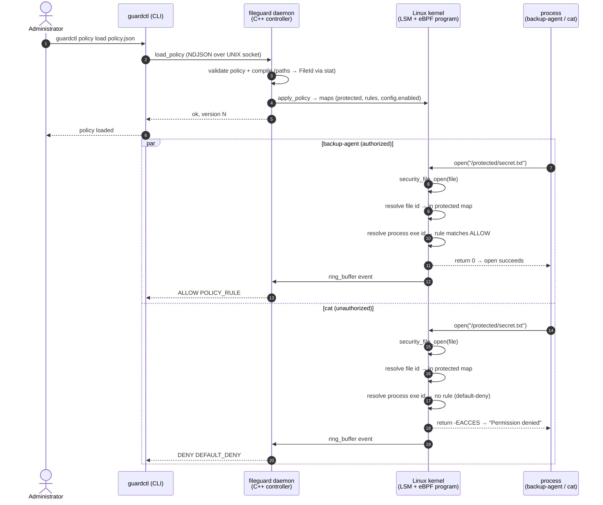
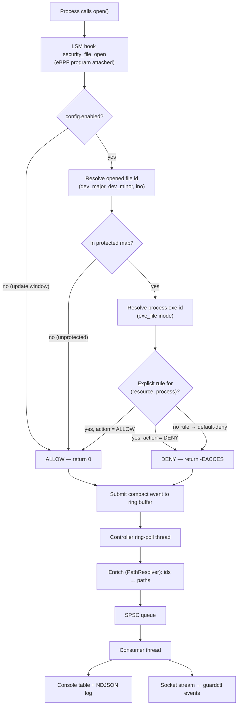
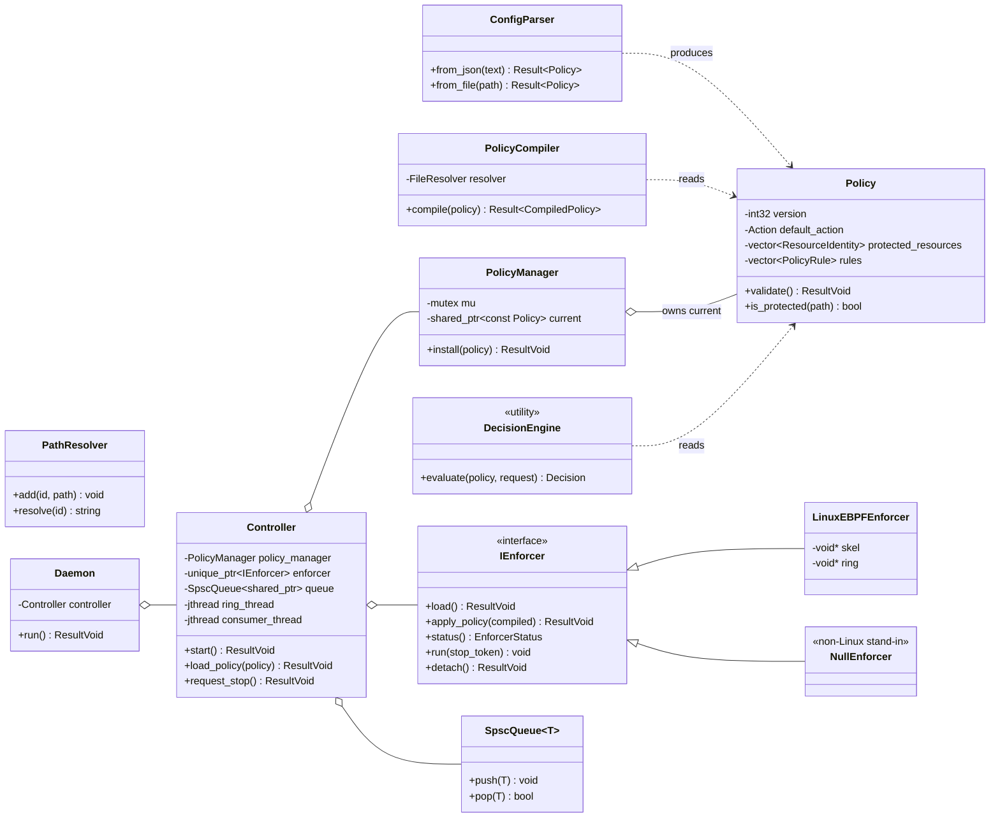

# eBPF FileGuard

[](https://github.com/swadhingoswami/ebpf-fileguard/actions/workflows/ci.yml)

**Kernel-Assisted Runtime File Access Control** · eBPF LSM + modern C++ (C++23)

> Protect a few specific files with a **default-deny allow-list**: only an
> explicitly authorized executable may open them — nothing else, not even
> `cat` as root — and every decision is emitted as a structured security event.

**Build details**

| | |
|---|---|
| Version | `0.1.0` |
| Latest commit | [`8597ea3`](https://github.com/swadhingoswami/ebpf-fileguard/commit/8597ea3755479d4963f73297dd3753a058727fae) |
| Branch | `main` |
| Language / standard | C++23 (`gcc ≥ 13`, `clang ≥ 16`) |
| Kernel | Linux ≥ 5.7 with `CONFIG_BPF_LSM`, `CONFIG_BPF_RINGBUF`, `CONFIG_DEBUG_INFO_BTF` |

---

## Table of contents

1. [The problem we are solving](#1-the-problem-we-are-solving)
2. [How it works](#2-how-it-works)
3. [Diagrams](#3-diagrams)
4. [Requirements](#4-requirements)
5. [Install & run](#5-install--run)
6. [What to validate](#6-what-to-validate)
7. [CLI reference](#7-cli-reference)
8. [Policy format](#8-policy-format)
9. [Performance & stress tools](#9-performance--stress-tools)
10. [Testing](#10-testing)
11. [Security model & limitations](#11-security-model--limitations)
12. [Documentation & repository](#12-documentation--repository)
13. [FAQ](#13-faq)
14. [Keywords / hashtags](#14-keywords--hashtags)
15. [License](#15-license)

---

## 1. The problem we are solving


### The core problem

Linux files are protected by **DAC** (ownership + permission bits) and,
optionally, by **MAC** frameworks (SELinux, AppArmor). Both answer *"who may
access this file"* in terms of **users** or **system-wide labels**.

Neither answers the question that many applications actually need:

> **"This one file — `/protected/secret.txt` — may be *opened* only by the
> backup agent. Nothing else. Not `cat`. Not `vim`. Not even root."**

That requirement is:

| Property | Why it matters |
|---|---|
| **Per-resource** | only a handful of files are sensitive; everything else must behave normally |
| **Per-process** | authorization is keyed on *which program* is running, not which user launched it |
| **Kernel-enforced** | a compromised or careless process cannot "ignore" the decision |
| **Programmable** | policy should be versioned, validated, and hot-loaded like configuration |
| **Auditable** | every denied (and allowed) attempt must produce a security event |

### Why existing tools fall short

| Mechanism | Answers | Gap |
|---|---|---|
| **DAC permissions** | "Is this *user* allowed?" | per-user, not per-program; **root bypasses it**; no decision audit |
| **SELinux** | whole-system type-enforcement | powerful but heavy; often disabled or unconfigured for one app |
| **AppArmor** | per-program profiles | closest conceptually, but system policy — not a data-driven runtime API |
| **auditd** | "what happened?" | observes only — **cannot deny** |
| **strace** | debugging | userspace observation; no enforcement; detectable |
| **inotify** | filesystem notifications | fires *after* the open; no process identity; no enforcement |

### What FileGuard is — and is not

FileGuard is a **narrow, programmable, kernel-enforced allow-list** that
**complements** (and works without) SELinux/AppArmor:

- ✅ **SELinux and AppArmor are optional.** FileGuard does not require, call,
  or depend on them. It needs only an eBPF-enabled kernel (`CONFIG_BPF_LSM`,
  ring buffer, BTF) — present by default on virtually all modern distro
  kernels. It runs whether those frameworks are disabled, unconfined, or
  fully enforcing (it simply adds an extra layer).
- ❌ **Not a replacement** for SELinux/AppArmor — no labels, no type
  enforcement, no system-wide policy. See [docs/12-comparison.md](docs/12-comparison.md).
- ❌ **Not protection** against a compromised kernel or a privileged
  attacker ([threat model](docs/02-threat-model.md)).

**Why eBPF?** The decision must be *enforced*, not reported. Attached to the
`security_file_open` **LSM hook**, the eBPF program's return value *is* the
decision — the syscall itself fails with `EACCES`. A userspace process
cannot ignore the denial or suppress its own audit event. The program is
**verifier-checked** before it runs (no arbitrary kernel memory access, no
injected logic), portable across kernels via **CO-RE/BTF**, and events travel
over a high-throughput **BPF ring buffer**. For the full reasoning, see
[Why eBPF](docs/06-ebpf-design.md).

---

## 2. How it works

```
cat calls open("/protected/secret.txt")
        │
        ▼
security_file_open(file)        ── LSM hook in the kernel's VFS open path
        │
        ▼
eBPF program (ebpf/fileguard.bpf.c)
  1. opened-file identity = (dev_major, dev_minor, ino)
  2. in protected map?  ──no──► return 0             (unprotected = allow)
  3. process identity = (dev_major, dev_minor, ino) of the executable image
  4. rule for (resource, process) in rules map?
        ├─ yes ──► apply rule action
        └─ no  ──► DENY  (default-deny for protected resources)
  5. submit compact event to the BPF ring buffer
        │
        ▼
return 0  |  -EACCES             ──► open succeeds | fails "Permission denied"
        │
        ▼
guardctl daemon (Linux):
  ring-poll thread → RawEvent → PathResolver (ids → paths) → SecurityEvent
        │
        ▼
SPSC queue → consumer thread → console table + NDJSON log + `guardctl events`
```

Key properties:

- **Enforcement happens in the kernel** — the open syscall fails; nothing to ignore.
- **Identity is filesystem identity, not a name** — `(major, minor, ino)`
  defeats symlink / hard-link / rename tricks and avoids the
  kernel-vs-userspace `dev_t` encoding trap.
- **Default-deny** — unknown executables are denied by construction.
- **Events are best-effort; enforcement is not** — if the ring buffer is
  full, decisions are still returned; only events are dropped.

---

## 3. Diagrams

> All diagrams are [Mermaid](https://mermaid.js.org/) and render on GitHub.
> The full set (including control-plane protocol and thread model) is in
> [docs/13-design-diagrams.md](docs/13-design-diagrams.md).

### 3.1 Sequence — one policy load, then one ALLOW and one DENY open



### 3.2 Workflow — the kernel decision



### 3.3 Class diagram — the userspace controller



---

## 4. Requirements

### Kernel (enforcement)

| Requirement | Minimum |
|---|---|
| eBPF LSM | Linux **5.7** (`CONFIG_BPF_LSM=y`, `bpf` in the `CONFIG_LSM` **order**) |
| BPF ring buffer | Linux **5.8** |
| CO-RE / BTF | `CONFIG_DEBUG_INFO_BTF=y` (`/sys/kernel/btf/vmlinux` present) |
| Recommended / tested | Linux **6.x** |
| Runtime privileges | `root` or `CAP_BPF`/`CAP_SYS_ADMIN` at load time |

> **SELinux and AppArmor are NOT required.** FileGuard needs only the eBPF
> features above (enabled by default on modern distro kernels) and refuses to
> start if the `bpf` LSM is missing from the boot LSM order (see §11).

### Build host

| Tool | Version |
|---|---|
| CMake | ≥ 3.24 |
| C++ compiler | gcc ≥ 13 or clang ≥ 16 (C++23 `std::expected`) |
| libbpf / bpftool / clang | ≥ 0.7 / present / BPF target (**Linux only**) |

`nlohmann/json` and `Catch2` are fetched automatically by CMake
(FetchContent).

---

## 5. Install & run

### Linux — full enforcement (5 minutes)

```bash
# 1) one-time dependency install + build
./scripts/build-linux.sh --install-deps     # apt: clang, libbpf-dev, bpftool, gcc-13 …

# 2) create the demo environment (needs root)
sudo ./scripts/setup-demo.sh
#   creates: /protected/secret.txt
#            /usr/local/bin/backup-agent     (the ALLOWed process)
#            /usr/local/bin/test-reader      (an unauthorized process)
#            /tmp/fileguard-demo-policy.json (the policy)

# 3) start enforcement
sudo ./build/guardctl policy load /tmp/fileguard-demo-policy.json
sudo ./build/guardctl status

# 4) prove it works
/usr/local/bin/backup-agent /protected/secret.txt   # → "Access allowed." + contents
cat /protected/secret.txt                            # → Permission denied.
/usr/local/bin/test-reader /protected/secret.txt    # → Permission denied.

# 5) watch live events / stop
sudo ./build/guardctl events          # streams decisions in real time
sudo ./build/guardctl stop            # detaches enforcement (fail-open)
```

### macOS — development of the portable core (no enforcement)

```bash
cmake -S . -B build
cmake --build build -j
./build/fileguard_tests               # 30 test cases, 93 assertions
```

On macOS the controller runs with a **null backend** (`backend: null`): policy
validation, the CLI and the control plane all work, but nothing is enforced —
eBPF LSM is Linux-only.

### Manual build options

```bash
cmake -S . -B build -DENABLE_EBPF=ON -DCMAKE_BUILD_TYPE=RelWithDebInfo   # Linux
cmake --build build -j "$(nproc)"
./build/fileguard_tests
```

| Option | Default | Meaning |
|---|---|---|
| `ENABLE_EBPF` | `OFF` (auto-off on macOS) | build the Linux eBPF LSM backend |
| `BUILD_TESTING` | `ON` | build the Catch2 unit tests |
| `ENABLE_SANITIZERS` | `OFF` | ASan + UBSan |

---

## 6. What to validate

A quick end-to-end checklist with the expected output. Run these after
`setup-demo.sh` + `policy load`.

| # | Action | Expected result |
|---|---|---|
| 1 | `guardctl status` | `backend: ebpf-lsm`, `attached: yes`, `enforcing: yes`, policy version matches |
| 2 | `backup-agent /protected/secret.txt` | prints **`Access allowed.`** + the file contents (exit 0) |
| 3 | `cat /protected/secret.txt` | prints **`Permission denied.`** (exit ≠ 0) |
| 4 | `test-reader /protected/secret.txt` | **`Permission denied.`** |
| 5 | `cat /etc/hosts` | works normally (unprotected file unaffected) |
| 6 | `guardctl events` (run in another terminal, then repeat 2–4) | one event row per decision: `ALLOW POLICY_RULE`, `DENY DEFAULT_DENY` |
| 7 | `guardctl policy list` | shows the loaded resource + rule |
| 8 | `guardctl policy validate config/policy.invalid.json` | **rejected** (exit 1), message about invalid action |
| 9 | `ln -s /protected/secret.txt /tmp/link; cat /tmp/link` | **`Permission denied.`** (symlink cannot bypass) |
| 10 | `ln /protected/secret.txt /tmp/hard; cat /tmp/hard` | **`Permission denied.`** (hard link cannot bypass) |
| 11 | `guardctl stop; cat /protected/secret.txt` | succeeds — **documented fail-open** after unload |

Expected event output (from `guardctl events`):

```
PID      UID   COMM           PROCESS                        FILE                       OP     ACTION  REASON
1234     0     backup-agent   /usr/local/bin/backup-agent    /protected/secret.txt     OPEN   ALLOW   POLICY_RULE
4567     1000  cat            /usr/bin/cat                   /protected/secret.txt     OPEN   DENY    DEFAULT_DENY
```

NDJSON form (also written by `serve --log FILE`):

```json
{"timestamp":"2026-08-18 12:00:00.123","pid":4567,"tgid":4567,"uid":1000,"gid":1000,"comm":"cat","process":"/usr/bin/cat","resource":"/protected/secret.txt","operation":"OPEN","action":"DENY","reason":"DEFAULT_DENY","rule_id":0}
```

> **If `status` reports `attached: yes` but nothing is ever denied**, check
> `/sys/kernel/security/lsm` — if `bpf` is not listed, the kernel never
> invokes the hook. FileGuard now refuses to start in that case (see §11).

---

## 7. CLI reference

The daemon runs as a background controller; the CLI talks to it over a UNIX
socket in the **runtime directory** (`/run/fileguard` as root on Linux,
`/tmp/fileguard` otherwise; override with `--runtime-dir`).

| Command | Description |
|---|---|
| `guardctl serve [--daemon] [--policy FILE] [--log FILE]` | run the controller (foreground or daemon) |
| `guardctl policy validate FILE` | validate + compile a policy offline (exit 0/1) |
| `guardctl policy load FILE` | install a policy; auto-starts a daemon if none is running |
| `guardctl policy list` | print the active policy |
| `guardctl status` | show enforcement state |
| `guardctl events [--json] [--count N]` | stream security events |
| `guardctl stop` | detach enforcement and shut down |
| `guardctl --version` / `--help` | version / usage |

---

## 8. Policy format

One JSON file describes everything (`config/policy.example.json`):

```json
{
    "version": 1,
    "defaults": { "action": "DENY" },
    "protected_resources": [
        { "path": "/protected/secret.txt", "operation": "OPEN" }
    ],
    "rules": [
        {
            "id": "allow-backup-agent",
            "resource": "/protected/secret.txt",
            "operation": "OPEN",
            "process": { "type": "exe_path", "value": "/usr/local/bin/backup-agent" },
            "action": "ALLOW"
        }
    ]
}
```

| Field | Meaning |
|---|---|
| `version` | policy version (reported by `status`/`list`) |
| `defaults.action` | decision for protected resources without a matching rule (default `DENY`) |
| `protected_resources[]` | absolute paths of files to protect (`operation: OPEN`) |
| `rules[]` | `id` (unique), `resource` (must be protected), `operation` (`OPEN`), `process.type/value` (`exe_path` + absolute executable path), `action` (`ALLOW`/`DENY`) |

**Validation** — absolute paths only; rule resources must be listed as
protected; rule ids unique; only `exe_path` identity and `OPEN` operation in
the MVP. At install time every path must resolve via `stat(2)`: a policy
referencing a missing file is **rejected** (a typo can never silently protect
nothing).

**Semantics** — protected resources are **default-deny**; unprotected files
are unaffected; a matching rule wins, otherwise the default applies. Identity
evolution (exe path → +UID → +stable attrs → content hash) is described in
[docs/05-policy-model.md](docs/05-policy-model.md).

---

## 9. Performance & stress tools

> **No benchmark numbers are claimed in this repo** — run the tools on your
> target kernel and record results. See [docs/10-performance.md](docs/10-performance.md).

### `fileguard-bench` — open(2) latency / throughput micro-benchmark

```bash
# baseline: no FileGuard installed
./build/fileguard-bench -f /protected/secret.txt -n 200000

# enforcement enabled (bench tool must be authorized in the policy)
./build/fileguard-bench -f /protected/secret.txt -n 200000
```

Reports: `total_time`, `avg_per_open (µs)`, `throughput (opens/s)`, `failed`.
Run once per scenario (baseline / enforced / deny-path) and compare the
`avg_per_open` and `throughput` columns. Expect only a few microseconds of
overhead on protected opens (two hash lookups + a ring-buffer write); opens of
unprotected files are one map miss and nearly free.

### `scripts/bench.sh` — full methodology (Linux, root)

```bash
sudo ./scripts/bench.sh [iterations]
```

Runs baseline vs enforced vs deny-path, plus **paced event-rate runs** at
~100/s, ~1k/s and ~10k/s (100k/s on fast hosts), appending rows to
`/tmp/fgtest/bench.csv`:

```
file,iterations,failed,per_open_us,throughput,elapsed_ns
```

Also verify **event rate vs ring-buffer loss**: count JSON-log lines against
opens on a protected file. A gap means events were dropped (observability
loss) — enforcement continues regardless.

### Access storm / event flood (integration Test 11)

`scripts/integration-tests.sh` hammers the protected file with 2000 opens
while the controller is enforcing, then asserts the controller stays
responsive (`guardctl status`) and the JSON log records the events. Use the
same technique with higher rates to exercise the 1 MiB ring buffer and the
SPSC event queue (bounded — the poller stalls under backpressure rather than
growing memory).

---

## 10. Testing

| Layer | How | What it covers |
|---|---|---|
| **Unit** | `./build/fileguard_tests` (30 cases / 93 assertions, portable) | policy parsing/validation, decisions, compilation, path resolution, SPSC queue, event sinks |
| **Integration** | `sudo ./scripts/integration-tests.sh` (Linux, root) | Tests 1–13: allow/deny, concurrency, unprotected files, reload, invalid-policy rejection, executable replacement, symlink/hard-link/rename, access storm, controller restart, unload → fail-open |
| **CI** | `.github/workflows/ci.yml` (green badge above) | macOS + Linux core build & unit tests; eBPF backend build; integration suite runs when the host kernel enables the **bpf LSM** (GitHub-hosted kernels do not, so it skips with a notice there) |

---

## 11. Security model & limitations

**What holds** ([details](docs/08-security-model.md)):
- Decisions are enforced in the kernel; the actor cannot ignore or suppress them.
- Root does not bypass the LSM hook.
- Default-deny shrinks the attack surface for protected files.
- Inode identity resists symlink/hard-link/rename bypasses.

**Known limitations** ([details](docs/11-limitations.md)):
- **Identity is Level-1** (executable inode): replacing an allowed binary
  changes its identity (denied until policy reload); scripts identify as
  their interpreter.
- **Fail-open on controller exit**: `guardctl stop` unloads the LSM program;
  the host returns to unprotected until a controller runs again (pinning to
  bpffs is the hardening step).
- **bpf LSM must be enabled**: if `bpf` is missing from
  `/sys/kernel/security/lsm`, FileGuard **refuses to start** (fail-open,
  loud) instead of silently enforcing nothing.
- **TOCTOU at install time**: replacing a protected file (new inode) after
  load means the new inode is not protected.
- **Opens only** in the MVP: reads of an already-open fd are not re-policed.
- **Privileged attackers win**: anyone with `CAP_BPF`/`CAP_SYS_ADMIN`/root is
  outside the threat model.
- **Not a replacement** for SELinux/AppArmor ([comparison](docs/12-comparison.md)).

---

## 12. Documentation & repository

| Doc | Content |
|---|---|
| [01-problem-statement](docs/01-problem-statement.md) | problem, scope, why it matters |
| [02-threat-model](docs/02-threat-model.md) | assets, adversaries, in/out of scope |
| [03-requirements](docs/03-requirements.md) | functional + non-functional + kernel requirements |
| [04-architecture](docs/04-architecture.md) | components, data flow, policy updates, events |
| [05-policy-model](docs/05-policy-model.md) | policy model, identity levels, TOCTOU |
| [06-ebpf-design](docs/06-ebpf-design.md) | hook selection, observation vs enforcement, maps, verifier |
| [07-cpp-design](docs/07-cpp-design.md) | C++ architecture, ownership, concurrency |
| [08-security-model](docs/08-security-model.md) | security properties, weaknesses, fail-open/fail-closed |
| [09-testing](docs/09-testing.md) | unit + integration test matrix |
| [10-performance](docs/10-performance.md) | benchmark methodology |
| [11-limitations](docs/11-limitations.md) | identity/resource/enforcement limitations |
| [12-comparison](docs/12-comparison.md) | DAC, SELinux, AppArmor, auditd, strace, inotify |
| [13-design-diagrams](docs/13-design-diagrams.md) | rendered sequence/class/workflow/protocol/thread diagrams |

```
CMakeLists.txt           top-level build (core, tools, tests, eBPF on Linux)
include/fileguard/       C++ headers (portable core)
src/                     C++ sources + Linux eBPF manager
ebpf/                    fileguard.bpf.c + Linux-only build rules
tools/                   backup-agent, test-reader, fileguard-bench
tests/                   Catch2 unit tests
config/                  example / deny-all / invalid policies
scripts/                 build-linux, setup-demo, integration-tests, bench
docs/                    01-problem … 13-design-diagrams
```

---

## 13. FAQ

**Does this replace SELinux/AppArmor?** No — it is a narrow, programmable,
per-application layer that also works *without* them. See §1 and
`docs/12-comparison.md`.

**Is SELinux or AppArmor required?** No. FileGuard only needs an eBPF-enabled
kernel (`CONFIG_BPF_LSM`, ring buffer, BTF).

**Why inode identity instead of paths?** Paths can be bypassed with symlinks,
hard links and renames; the inode survives all of those. The tradeoff is that
replacing the file (new inode) is not auto-detected.

**Why do I need BTF?** The program uses CO-RE to read kernel structs
(`task->mm->exe_file`, `inode->i_sb`) without hard-coded offsets.

**I'm on macOS — why `backend: null`?** eBPF LSM is Linux-only; on macOS the
core builds and tests, but there is no kernel enforcement.

**What happens if the controller crashes?** The LSM program is detached and
the host returns to fail-open until a controller runs again.

---

## 14. Keywords / hashtags

**#eBPF** **#eBPFLSM** **#Linux** **#LinuxSecurity** **#LinuxKernel** **#CPlusPlus**
**#Cpp23** **#SecurityEngineering** **#FileAccessControl** **#AccessControl**
**#DefaultDeny** **#AllowList** **#LSM** **#BPF** **#CO-RE** **#BTF**
**#KernelSecurity** **#RuntimeSecurity** **#ApplicationSecurity**
**#KernelHooking** **#RingBuffer** **#SyscallSecurity** **#SecurityTooling**
**#CyberSecurity** **#SystemsProgramming** **#Observability** **#Audit**
**#DevSecOps** **#eBPFPrograms** **#KernelDevelopment** **#SecurityResearch**

> Topics used to index this repository: `eBPF`, `LSM`, `security_file_open`,
> `Linux security modules`, `default-deny allow-list`, `kernel-enforced access
> control`, `C++20/23`, `libbpf`, `ring buffer`, `runtime security`, `threat
> model`, `security events`.

---

## 15. License

MIT — see [LICENSE](LICENSE).
