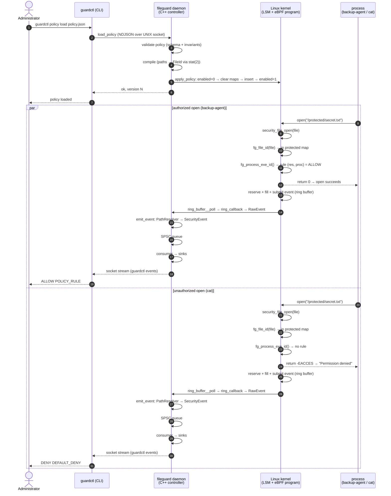
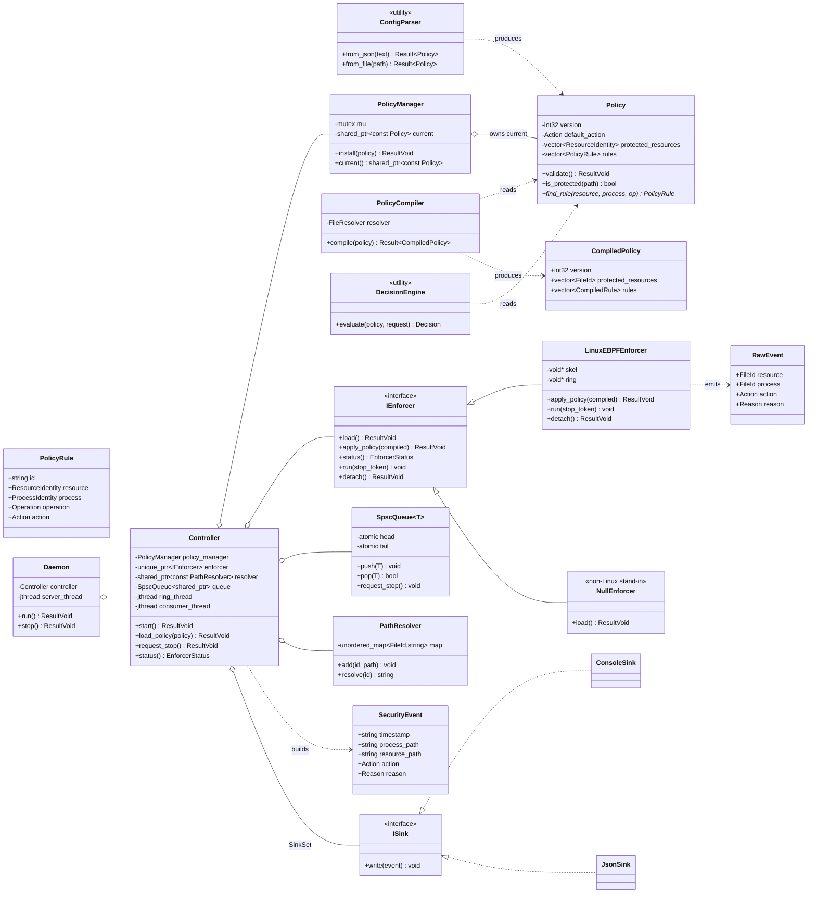
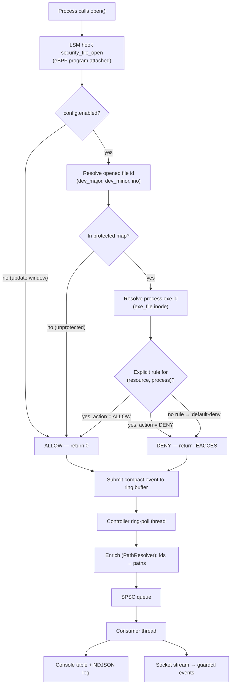
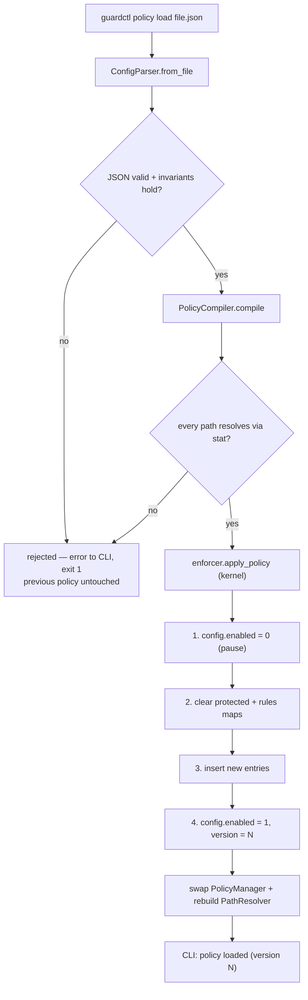
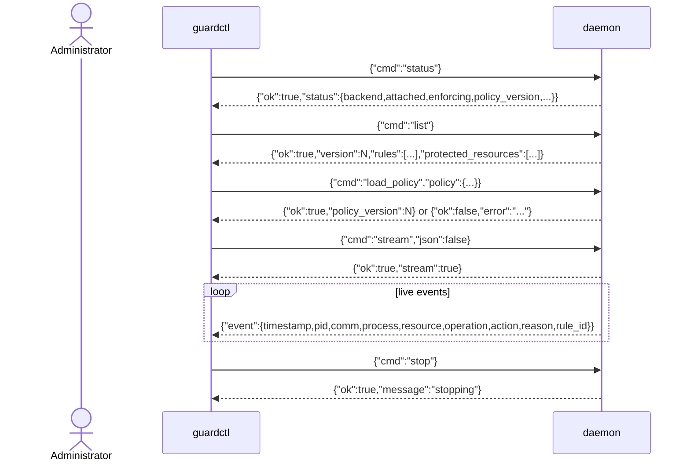
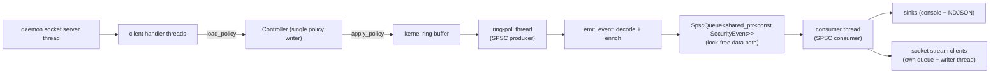
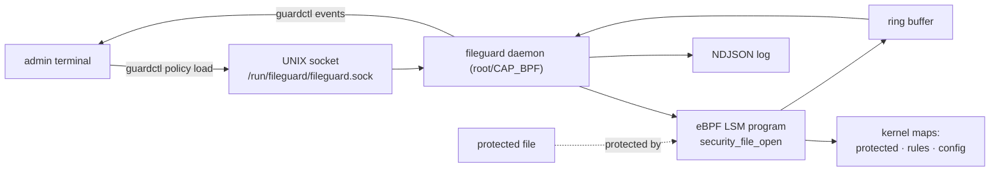

# 13 — Design Diagrams

Rendered diagrams for the eBPF FileGuard design. All diagrams are
[Mermaid](https://mermaid.js.org/) and render directly on GitHub and in
editors that support Mermaid.

## Contents

1. [Sequence diagram — policy load + enforcement + events](#sequence-diagram)
2. [Class diagram — userspace C++](#class-diagram)
3. [Workflow — kernel decision flow](#workflow)
4. [Control-plane protocol](#control-plane-protocol)
5. [Thread model & concurrency](#thread-model--concurrency)
6. [Deployment / runtime layout](#deployment)

---

## Sequence diagram

A policy load, followed by one authorized and one unauthorized open, then the
event path.

## Class diagram

**Ownership & lifetime** (summary, full detail in `docs/07-cpp-design.md`):

| Object | Owner | Lifetime notes |
|---|---|---|
| `Policy` | `PolicyManager` (via `shared_ptr<const Policy>`) | immutable; swapped atomically on load |
| `IEnforcer` | `Controller` (`unique_ptr`) | destroyed in `Controller::~Controller` → `detach()` |
| `PathResolver` | `Controller` (`shared_ptr<const>`) | rebuilt per policy; lock-free reads |
| `SpscQueue` | `Controller` (value) | SPSC: poller → consumer; bounded, drains on stop |
| `jthread`s | `Controller` | joined in `request_stop()` |
| `SocketStreamClient` | `Daemon` | per-client queue + writer thread; dropped events counted |

## Workflow

### Kernel decision flow

### Policy update flow (userspace)

## Control-plane protocol

The daemon exposes a **UNIX domain socket** (`/run/fileguard/fileguard.sock`
as root, `/tmp/fileguard/…` otherwise) speaking **NDJSON** — one JSON object
per line.

## Thread model & concurrency

- **Data path is lock-free**: one producer (ring poller), one consumer
  (logger); atomics + a mutex/condvar pair only for blocking.
- **Policy**: writers serialized; readers get an immutable `shared_ptr`.
- **Sinks**: single-writer (consumer thread only) → no locks.
- **Shutdown**: `request_stop()` → queue stop (unblocks + drains) → join
  threads → `enforcer.detach()` → socket unlink.

## Deployment

